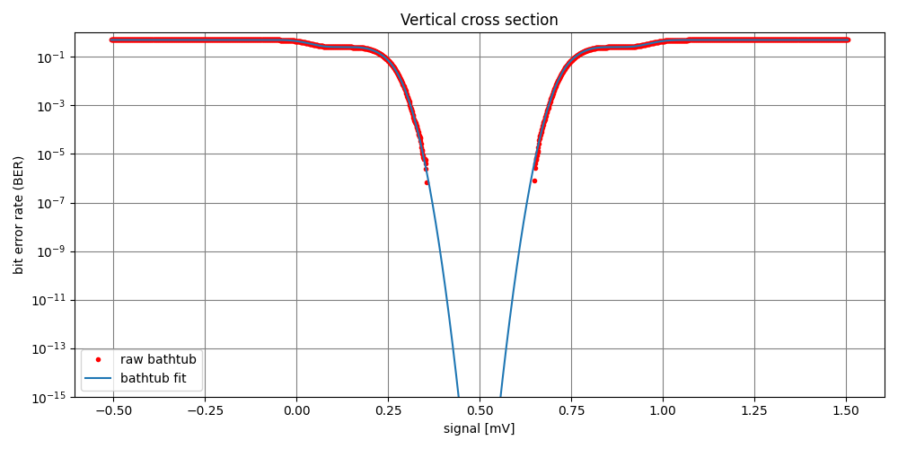

Project for analyzing time-series data from link models or measurements.  Generates eye diagrams, extracts statistics, and contains useful plotting utilities.

## Example usage

```python
    from stateye import IdealEye

    eye = IdealEye(
        datarate_gbps=32,
        dt_sec=31.25e-12 / samples_per_symbol,
    )
```

Adding data and plotting is simple.  As the data is added, a "waveform analysis" is automatically executed, which computes values like the rise/fall times, OMA, and 8180 OMA (if a long enough pattern is found).  This data is then drawn on a 2D histogram.

```python
    import numpy as np
    wvf = np.random.rand(100000)
    eye.add_data(wvf, wvf_units="mV")

    eye.plot()
```

Once all of the data has been added (multiple calls to `add_data()` can be made!) the histogram itself can be analyzed in order to extract statistics from the eye diagram.  This analysis is more computationally expensive and so is only computed when `get_measurements()` is called (after all the data has been added).

```python
    msmts = eye.get_measurements()
    msmt_units = eye.get_measurement_units()
```

There are two sampling modes, "half_ui" and "adaptive".  Adaptive offset is the default mode (if not specified), where the timing delay between the edge and sampling point is optimized to maximize the inner eye height.  Half-UI mode simply offsets the sampler by 1/2 the unit interval from the edge position.  This mode is specified as a keyword argument in the `IdealEye` constructor as follows:

```python
    eye = IdealEye(
        datarate_gbps=32,
        dt_sec=31.25e-12 / samples_per_symbol,
        sampling_offset_mode="half_ui",
    )
```

## Custom Eyes

A second type of eye called a `CustomEye` behaves identically to `IdealEye`, except that the sampling instants must be provided by the user.  This is useful when trying to generate eye diagrams from data that is not sampled on an evenly spaced time grid (e.g. when connecting to a CDR block).

```python
    from stateye import CustomEye

    eye = CustomEye(
        datarate_gbps=32,
        dt_sec=31.25e-12 / samples_per_symbol,
    )

    sampling_times = np.arange(nbits) * period
    eye.add_data(wvf, wvf_units="mV", sampling_times, "sec")
```

## Installation

Currently tested on Python 3.8.

Installation is performed in the following steps:

1) Clone the repo.
2) Make sure Cython is installed.  If not, run

```bash
pip install Cython
```

3) Install the required libraries:

```bash
pip install -r requirements.txt
```

4) Install `stateye` by navigating to the project folder and running
```bash
python setup.py install
```

If you'd like to test that the library can be installed, you can do an inplace
build of the Cython files and run the unit tests

```bash
python setup.py build_ext --inplace
python -m pytest -s tests/
```

### Installation on Mac with ARM-based CPUs

For Mac users with one of the M-series ARM-based CPUs, you might need to install XCode (for `gcc`)
and also Rosetta (for now) in order to use `arch=x86_64` binaries compiled for
intel CPUs.  Once XCode is installed, Rosetta can be installed from the command
line using:

```bash
softwareupdate --install-rosetta
```

### Local development

When running code from within the repo for development or checking unit tests, you'll first need 
Cython to build the .cpp files and compile the shared libraries.  Here's how you do this locally:

```bash
python setup.py build_ext --inplace
```

Pytest is used for the unit testing.  Here's how you check if unit tests are passing:

```bash
python -m pytest -s tests/
```

## Background (a look under the hood)

At a high-level stateye simply takes a waveform from a user, draws an eye diagram, and returns a list of metrics extracted from the waveform and eye histograms.  However, there are some important details to remember when using `stateye`.  Internally the eye diagram is represented by a 3-dimensional array of size `nx x ny x d`, where `nx` and `ny` are the 2D eye diagram dimensions.  The third dimension `d` corresponds to each unique data pattern.  

For eye data processing, there are generally three steps:
1. Extract statistics from the waveform
    - This includes data pattern filtering, edge time calculations, jitter, computing OMA, etc.
2. Draw the waveform on the eye diagram
3. Extract statistics from the eye diagram or bathtub arrays
    - BER, eye height/width, TDEC, etc.

### Waveform metrics
For a number of metrics (such as OMA, TDEC, VECP, rise time, fall time, etc.) the 1-level and 0-level need to be computed.  Standards typically specify that these two values should be determined from a slow clock pattern (long series of 0's and 1's).  However, often times we're just dealing with a waveform with random data.  `stateye` estimates these in three ways:
- `8180`: Stateye will filter on long series of 8x ones or 8x zeros
- `4140`: Stateye will filter on shorter series of 4x ones or 4x zeros, since these are statistically much more likely to occur in random data
- `xp`: Stateye will look at all of the data, and estimate the the data levels from the distributions above and below the crossing-point

`stateye` will append `_8180`, `_4140`, or `_xp` to several measurement names (e.g. `tdec_8180`) so you know which method was used to compute the 1 or 0 level.  It is strongly recommended that you use the `_8180` metrics, provided that long enough 1 and 0 patterns are found in the waveform.

### Data levels (dLevs)

By default, `stateye` filters on 3 bits before the sampling instant and 1 bit after the sampling instant for NRZ signals.  This means the pattern is 5-bits wide and so `d = 2^5 = 32`.  For signals with more or less pre- or post-cursor ISI, this filter can be expanded or reduced, but increasing it comes at the cost of larger memory and slower data processing.  To do this, simply provide some additional arguments to the eye class:

```python
    eye = IdealEye(
        datarate_gbps=datarate_gbps,
        dt_sec=dt_sec,
        num_bits_to_filter_on_after=0,  # Must be an int >= 0
        num_bits_to_filter_on_before=0  # Must be an int >= 0
    )
```
In the above example, there is effectively no data pattern filtering, so `d=1`.

Why do we care about filtering on the data pattern?  If we want to compute the BER from the eye and the random noise is known to be Gaussian, but there is ISI from say a band-limited channel, we cannot just fit a single Gaussian to the whole 1-level or 0-level at the sampling instant.  However, by looking at each data pattern in isolation, we can do a fit to each unique data level (dLev).  This results in higher accuracy for computing things like BER which require extrapolation from the distribution tails.

We can also look at the mean data level for each pattern filtered on.  This info lives in the measurements dict returned by `eye.get_measurements()`:

```python
eye = IdealEye(
    datarate_gbps=datarate_gbps,
    dt_sec=dt_sec,
    num_bits_to_filter_on_before=2,
    num_bits_to_filter_on_after=0,
)
eye.add_data(wvf, wvf_units="mV")
msmts = eye.get_measurements()
print(msmts["d_lev"])
# prints: [0.005321281747282695, 0.7498008287426187, 0.20850863748943382, 0.9523754594440866, 0.04744698994022087, 0.7919176056843705, 0.2501799717431034, 0.9943432354812164]

print(eye.data_patterns)
# prints: [[0, 0, 0], [0, 0, 1], [0, 1, 0], [0, 1, 1], [1, 0, 0], [1, 0, 1], [1, 1, 0], [1, 1, 1]]
```
In this case the third bit is the data bit, and the two before it are the pre-cursor bits.  You can also get exactly the d_lev for a specific bit pattern relative to the sampler threshold with the `get_dlev()` method:

```python
print(eye.get_dlev(fb=[0, 0], v=1, fa=[])) + msmts["threshold"]
# prints: 0.7498008287426187
```

You can also plot the eye diagram corresponding to specific data patterns.  For example, if we have an eye with 3-bit wide filter (1-bit before and 1-bit after the main cursor), and we want to visualize the [0,1,0] pattern, we can specify this in the `eye.plot(pattern=...)` keyword argument:
```python
eye.plot(show=True, pattern=[0,1,0])
```


### A note on TDEC

Transmitter dispersion and eye closure (TDEC) is implemented according to IEEE Std 802.3-2015 and requires a few values from the user in order to be specified properly:

```python
eye = IdealEye( ... )
eye.set_tdec_s_noise(s)
eye.set_tdec_m1(m1)
eye.set_tdec_m2(m2)
eye.set_tdec_ber(ber)
```
In the above:
- S is the standard deviation of the noise of the O/E and oscilloscope combination.  This needs to be in the base units for the y-direction of the eye (volts).
- M1 accounts for mode partition noise that could be added by the optical channel
- M2 accounts for modal noise that could be added by the optical channel
- BER is the target bit error rate for the link


# Bath tub plots

`stateye` automatically constructs the bathtub plot (eye diagram integrated upwards for ones and downwards for zeros).  Internally there are two bathtubs:
- `raw_bathtub`, which is constructed from the raw data
- `bathtub`, which is a q-scale fit of a Gaussian to each data level

Here is an example plot of each, using the `plot_bathtub()` method:

```python
eye.plot_bathtub(raw_bathtub=True, show=True)
```


```python
eye.plot_bathtub(raw_bathtub=False, show=True)
```


These are constructed from the following eye
```python
eye.plot(show=True)
```


There is also the ability to plot the bathtub cross-section horizontally (at the vertical sampler thershold), or vertically (at the horizontal sampling instant).  To do this, use the `eye.plot_bathtub_cross_section()` method, which accepts two arguments:
- `direction` which can be either `"vertical"` or `"horizontal"`
- `y_axis` which can be either `"q-scale"` or `"ber"` (if `direction="vertical"`)

```python
eye.plot_bathtub_cross_section(show=True, direction="vertical", y_axis="ber")
```

```python
eye.plot_bathtub_cross_section(show=True, direction="vertical", y_axis="q-scale")
```
